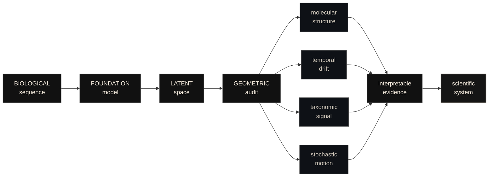
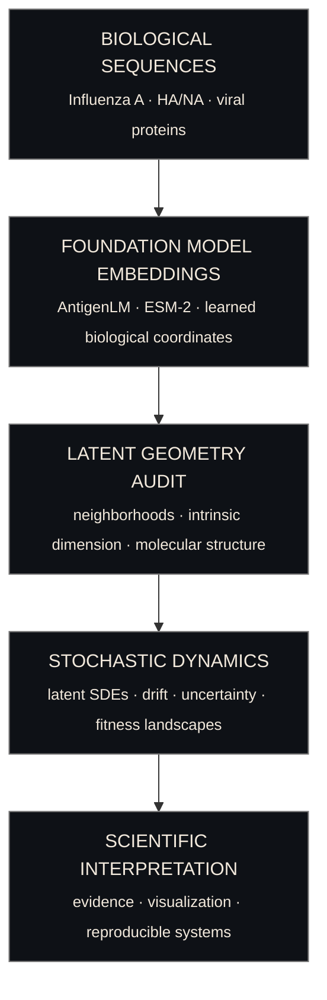

<div align="center">

<sub><code>SYSTEM STATUS // RESEARCH PROFILE</code></sub>

# CARLOS MANUEL ORREGO FRANCO

### AI for Biology · Latent Geometry · Stochastic Evolution · Research Systems

<sub><code>APPLIED MATHEMATICS × COMPUTER SCIENCE × BIOLOGICAL FOUNDATION MODELS</code></sub>

<br/>

[](https://www.linkedin.com/in/cmorregof)
[](https://orcid.org/0009-0001-9163-5137)
[](mailto:cmorregofranco@gmail.com)
[](https://github.com/The-Velveteen-Project)

</div>

---

## `00_signal_map`


```mermaid
flowchart LR
    A["BIOLOGICAL<br/>sequence"] --> B["FOUNDATION<br/>model"]
    B --> C["LATENT<br/>space"]
    C --> D["GEOMETRIC<br/>audit"]

    D --> E["molecular<br/>structure"]
    D --> F["temporal<br/>drift"]
    D --> G["taxonomic<br/>signal"]
    D --> H["stochastic<br/>motion"]

    E --> I["interpretable<br/>evidence"]
    F --> I
    G --> I
    H --> I

    I --> J["scientific<br/>system"]

    classDef core fill:#111111,stroke:#888888,color:#F2E9DC,stroke-width:1.2px;
    classDef aux fill:#0E1116,stroke:#555555,color:#CFC7BA,stroke-width:1px;
    classDef final fill:#151515,stroke:#A89F91,color:#F2E9DC,stroke-width:1.4px;

    class A,B,C,D,I core;
    class E,F,G,H aux;
    class J final;
```

> I study the afterimage of biological foundation models: the geometry left behind when viral sequences are compressed into coordinates.

---

## `01_manifesto`

A viral sequence enters as text.  
A model compresses it into coordinates.  
Somewhere in that compression, molecular similarity, evolutionary memory, temporal drift, and taxonomic structure either survive or disappear.

My work is about auditing that space.

I am a mathematician and computer scientist working at the intersection of **AI for Biology**, **scientific machine learning**, **bioinformatics**, and **stochastic modeling**.

My current research studies how biological foundation models organize viral sequence information in latent space, with emphasis on **Influenza A HA/NA**, **AntigenLM representations**, **latent geometry**, and **continuous-time stochastic models of antigenic drift**.

I care about systems where geometry, probability, and computation do not merely decorate the interface — they form the analytical core beneath it.

```yaml
operating_principles:
  - rigor before hype
  - biological signal before aesthetic plots
  - interpretable geometry before black-box confidence
  - stochastic models before deterministic storytelling
  - research into systems
```

---

## `02_current_vector`


```mermaid
flowchart TB
    A["BIOLOGICAL SEQUENCES<br/><sub>Influenza A · HA/NA · viral proteins</sub>"]
    B["FOUNDATION MODEL EMBEDDINGS<br/><sub>AntigenLM · ESM-2 · learned biological coordinates</sub>"]
    C["LATENT GEOMETRY AUDIT<br/><sub>neighborhoods · intrinsic dimension · molecular structure</sub>"]
    D["STOCHASTIC DYNAMICS<br/><sub>latent SDEs · drift · uncertainty · fitness landscapes</sub>"]
    E["SCIENTIFIC INTERPRETATION<br/><sub>evidence · visualization · reproducible systems</sub>"]

    A --> B --> C --> D --> E

    classDef node fill:#0E1116,stroke:#777777,color:#F2E9DC,stroke-width:1.1px;
    class A,B,C,D,E node;
```

My thesis investigates **continuous stochastic modeling of antigenic drift in Influenza A** using latent SDEs guided by competitive fitness landscapes.

In practice, this means asking whether learned biological representation spaces can support a mathematical language for:

<table>
<tr>
<td><strong>DRIFT</strong></td>
<td>How viral representations move through time.</td>
</tr>
<tr>
<td><strong>UNCERTAINTY</strong></td>
<td>How stochasticity appears in latent evolutionary trajectories.</td>
</tr>
<tr>
<td><strong>SELECTION</strong></td>
<td>How competitive fitness landscapes can guide motion.</td>
</tr>
<tr>
<td><strong>GEOMETRY</strong></td>
<td>How biological structure survives compression.</td>
</tr>
</table>

---

## `03_research_objects`

| Object | Core idea | Signal |
| --- | --- | --- |
| **[`latent_geometry`](https://github.com/cmorregof/latent_geometry)** | Geometric audit of AntigenLM latent representations for Influenza A HA/NA sequences. | `AntigenLM` · `latent-geometry` · `AI-for-biology` |
| **AntigenSDE** | Continuous-time stochastic modeling of antigenic drift over learned biological representations. | `latent-SDEs` · `fitness-landscapes` · `stochastic-dynamics` |
| **[`FluGenome3D`](https://github.com/cmorregof/FluGenome3D)** | Deployable visual atlas for derived Influenza A representation artifacts. | `research-interface` · `viral-atlas` · `safe-visualization` |
| **[`hanta_vec`](https://github.com/cmorregof/hanta_vec)** | Latent-space audit of Orthohantavirus glycoprotein embeddings using ESM-2. | `ESM-2` · `protein-embeddings` · `representation-audit` |

---

## `04_latent_geometry`

**Geometric audit of AntigenLM representations for Influenza A HA/NA.**

This project studies whether AntigenLM latent spaces preserve biologically meaningful structure across molecular similarity, temporal organization, subtype behavior, intrinsic dimension, and evolutionary-taxonomic neighborhoods.

It treats the embedding space as an object of scientific inspection: not a visualization endpoint, but a biological hypothesis surface.

```yaml
object:
  name: latent_geometry
  model: AntigenLM
  biological_domain: Influenza A HA/NA
  questions:
    - Do learned neighborhoods preserve molecular similarity?
    - Does temporal structure survive embedding compression?
    - Are subtype and taxonomic patterns geometrically detectable?
    - Can latent space support downstream stochastic modeling?
```

<p align="right">
  <a href="https://github.com/cmorregof/latent_geometry"><strong>repository →</strong></a>
</p>

---

## `05_antigensde`

**Stochastic modeling of antigenic drift over learned biological representations.**

AntigenSDE explores continuous-time latent dynamics for Influenza A evolution, combining biological sequence embeddings with stochastic differential equations, competitive fitness landscapes, Monte Carlo simulation, and uncertainty-aware trajectories.

The goal is not to decorate embeddings with dynamics, but to ask whether latent biological spaces can sustain a useful mathematical model of motion.

```txt
latent state · drift field · diffusion term · fitness landscape · trajectory ensemble
```

---

## `06_flugenome3d`

**A visual research atlas for derived Influenza A artifacts.**

FluGenome3D is a deployable interface for inspecting sequence-context metrics, latent geometry, structural QC signals, and derived biological artifacts without exposing restricted raw data.

It sits between research notebook, atlas, and instrument panel.

```yaml
system:
  name: FluGenome3D
  role: visual research atlas
  data_policy: derived artifacts only
  interface_between:
    - latent geometry
    - sequence context
    - structural QC
    - scientific storytelling
```

<p align="right">
  <a href="https://github.com/cmorregof/FluGenome3D"><strong>repository →</strong></a>
</p>

---

## `07_systems_layer`

I also maintain **The Velveteen Project**, a separate applied systems wing for agentic workflows, stochastic prototypes, and deployable AI infrastructure.

Velveteen is where research signals become working systems: insight engines, orchestration layers, FastAPI backends, and human-in-the-loop workflows.

It is adjacent to this profile, not its center.

| System | Core idea | Signal |
| --- | --- | --- |
| **Velveteen Insight Engine** | Human-in-the-loop agentic workflow system for transforming technical signals into structured research notes and implementation handoffs. | `agentic-workflows` · `research-systems` · `LLM-orchestration` |
| **EcoAgent** | Stochastic early-warning prototype for landslide risk in the Colombian Andes. | `SDEs` · `risk-modeling` · `FastAPI` |
| **StochastoGreen** | Climate transition-risk simulator for financial portfolios. | `jump-diffusion` · `simulation` · `decision-systems` |

<p align="right">
  <a href="https://github.com/The-Velveteen-Project"><strong>organization →</strong></a>
</p>

---

## `08_capabilities_map`

```txt
AI for Biology                  ███████████████████░
latent representation audit      ███████████████████░
scientific machine learning      ██████████████████░░
bioinformatics                   ██████████████████░░
mathematical modeling            ███████████████████░
stochastic modeling              ████████████████░░░░
research systems                 ████████████████░░░░
agentic AI systems               ███████████████░░░░░
```

---

## `09_toolkit`

<div align="center">


</div>

---

## `10_academic_identity`

```yaml
name: Carlos Manuel Orrego Franco

background:
  - Mathematics
  - Computer Science
  - Statistical Specialization
  - MSc candidate in Applied Mathematics

research_interests:
  - AI for Biology
  - Biological foundation models
  - Computational biology
  - Scientific machine learning
  - Latent representation geometry
  - Stochastic modeling
  - Antigenic drift
  - Research systems

current_focus:
  - AntigenLM latent representations
  - Influenza A HA/NA sequence embeddings
  - geometric auditing of biological latent spaces
  - latent SDEs guided by competitive fitness landscapes

style:
  - rigorous
  - cinematic
  - slightly nocturnal
  - allergic to shallow dashboards
```

---

## `11_open_problems`

<table>
<tr>
<td><strong>01</strong></td>
<td>What kind of geometry do biological foundation models induce?</td>
</tr>
<tr>
<td><strong>02</strong></td>
<td>When does a latent neighborhood become biologically meaningful?</td>
</tr>
<tr>
<td><strong>03</strong></td>
<td>Can antigenic drift be modeled as stochastic motion in representation space?</td>
</tr>
<tr>
<td><strong>04</strong></td>
<td>How much evolutionary signal survives model compression?</td>
</tr>
<tr>
<td><strong>05</strong></td>
<td>What should a scientific interface reveal, hide, or refuse to oversimplify?</td>
</tr>
</table>

---

## `12_open_to`

I am open to selected research conversations and collaborations around:

- **AI for Biology**, biological foundation models, and computational biology.
- **Latent geometry**, representation audits, and scientific ML.
- **Influenza A**, antigenic drift, and biological sequence modeling.
- **Stochastic modeling**, latent SDEs, simulation, and uncertainty-aware systems.
- **Research systems** that turn scientific artifacts into inspectable tools.

---

<div align="center">

```txt
CURRENT VECTOR
AI for Biology × latent geometry × stochastic evolution × research systems
```

<sub><code>Models are compressed worlds. Geometry is the residue they leave behind.</code></sub>

</div>
