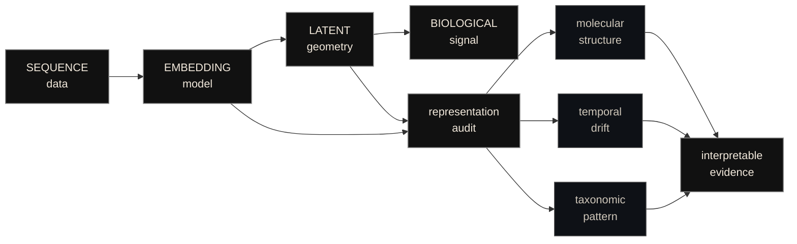

<div align="center">

<sub><code>SYSTEM STATUS // RESEARCH PROFILE</code></sub>

# CARLOS MANUEL ORREGO FRANCO

### Mathematical modeling · Scientific ML · Bioinformatics · Agentic systems

<sub><code>APPLIED MATHEMATICS × COMPUTER SCIENCE × AI FOR SCIENCE</code></sub>

<br/>

[](https://www.linkedin.com/in/cmorregof)
[](https://www.kaggle.com/cmorregofranco)
[](mailto:cmorregofranco@gmail.com)
[](https://thevelveteenproject.vercel.app/)

</div>

---

## `00_signal_map`


```mermaid
flowchart LR
    A["SEQUENCE<br/>data"] --> B["EMBEDDING<br/>model"]
    B --> C["LATENT<br/>geometry"]
    C --> D["BIOLOGICAL<br/>signal"]

    B --> E["representation<br/>audit"]
    C --> E
    E --> F["molecular<br/>structure"]
    E --> G["temporal<br/>drift"]
    E --> H["taxonomic<br/>pattern"]

    F --> I["interpretable<br/>evidence"]
    G --> I
    H --> I

    classDef core fill:#111111,stroke:#888888,color:#F2E9DC,stroke-width:1.2px;
    classDef aux fill:#0E1116,stroke:#555555,color:#CFC7BA,stroke-width:1px;
    class A,B,C,D,E,I core;
    class F,G,H aux;
```

> I am interested in models that make biological structure visible, auditable, and computationally useful.

---

## `01_manifesto`

I am a mathematician and computer scientist working at the intersection of **bioinformatics**, **machine learning**, **scientific computing**, and **mathematical modeling**.

My current research explores how modern AI systems encode biological structure: from **sequence-model embeddings** to **latent spaces** where molecular, temporal, and taxonomic signals may quietly emerge.

I care about systems where geometry, probability, and computation do not merely decorate the interface — they form the analytical core beneath it.

```yaml
operating_principles:
  - rigor before hype
  - biological signal before aesthetic plots
  - interpretable models before theatrical complexity
  - research into systems
```

---

## `02_current_focus`

<table>
  <tr>
    <td><strong>BIOINFORMATICS</strong></td>
    <td>Studying biological sequence data through embeddings, representation learning, and computational analysis.</td>
  </tr>
  <tr>
    <td><strong>LATENT GEOMETRY</strong></td>
    <td>Auditing molecular, temporal, and taxonomic structure in biological sequence-model representations.</td>
  </tr>
  <tr>
    <td><strong>AI FOR SCIENCE</strong></td>
    <td>Building reproducible pipelines for scientific discovery, model diagnosis, and evidence-driven interpretation.</td>
  </tr>
  <tr>
    <td><strong>STOCHASTIC MODELING</strong></td>
    <td>Working with diffusion processes, jump models, numerical methods, and probabilistic reasoning.</td>
  </tr>
</table>

---

## `03_selected_systems`

| System                           | Core idea                                                                                                         | Signal                                                               |
| -------------------------------- | ----------------------------------------------------------------------------------------------------------------- | -------------------------------------------------------------------- |
| **The Velveteen Project**        | Founder-led applied decision systems lab connecting rigorous modeling with deployable tools.                      | `applied-ai` · `decision-systems` · `research-to-systems`            |
| **Latent Geometry Audit**        | Research pipeline for studying structure in biological sequence-model embeddings.                                 | `bioinformatics` · `representation-analysis` · `intrinsic-dimension` |
| **Influenza Embedding Analysis** | Computational study of molecular, temporal, and evolutionary-taxonomic geometry in viral protein representations. | `AntigenLM` · `protein-embeddings` · `AI-for-biology`                |
| **EcoAgent**                     | Stochastic climate-risk assistant for real-time landslide reasoning.                                              | `SDEs` · `agents` · `risk-modeling`                                  |
| **StochastoGreen**               | Climate transition-risk simulator for financial portfolios.                                                       | `jump-diffusion` · `FastAPI` · `multi-agent interpretation`          |

---

## `04_capabilities_map`

```txt
bioinformatics               ██████████████████░░
scientific machine learning  ██████████████████░░
latent representation audit  ███████████████████░
mathematical modeling        ███████████████████░
agentic AI systems           ████████████████░░░░
stochastic modeling          ████████████████░░░░
```

---

## `05_toolkit`

<div align="center">


</div>

---

## `06_academic_identity`

```yaml
name: Carlos Manuel Orrego Franco
background:
  - Mathematics
  - Computer Science
  - Statistical Specialization
  - MSc candidate in Applied Mathematics
research_interests:
  - Bioinformatics
  - Artificial Intelligence for Science
  - Scientific Computing
  - Computational Biology
  - Representation Learning
  - Stochastic Modeling
style:
  - rigorous
  - cinematic
  - slightly nocturnal
  - allergic to shallow dashboards
```

---

## `07_open_to`

I am open to selected collaborations around:

* **Bioinformatics**, biological sequence modeling, and protein/viral embedding analysis.
* **AI for science** and representation analysis.
* **Mathematical modeling** and scientific Python pipelines.
* **Applied decision systems** that need more than a chatbot layer.

---

<div align="center">

```txt
CURRENT VECTOR
bioinformatics × latent geometry × scientific ML × applied decision systems
```

<sub><code>“Research becomes real when it survives contact with the world.”</code></sub>

</div>

