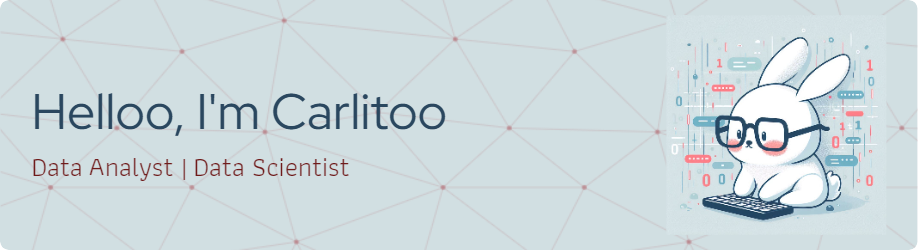

<!EN:> 🔍 Data Analyst & Data Scientist | Mathematician & Statistical Specialist 📊📐 | Computer Science Student & Master's Candidate in Applied Mathematics 🎓 | Interested in Large Language Models (LLMs) and Deep Learning 🤖 | Rabbit Lover 🐰 and Anime Fan 🎌 | Blending Data Insights with Creativity and Fun

<!ES:
🔍 Analista de Datos & Científico de Datos | Matemático y Especialista en Estadística 📊📐 | Estudiante de Ciencias de la Computación y Maestrando en Matemática Aplicada 🎓 | Interés en los Grandes Modelos de Lenguaje (LLMs) y el Deep Learning 🤖 | Amante de los Conejos 🐰 y el Anime 🎌 | Fusionando Datos con Creatividad y Diversión>
***
 
## ⚡️ A Few Quick Facts

- 🔭 I’m currently working on **LLM classification** and optimization.
- 🌱 Currently learning about **Advanced Deep Learning techniques** and **trading algorithms.**
- 👯 I’m looking to collaborate on **Machine learning projects** and data science innovations
- 🤔 I’m looking for help with _Implementing new LLM methodologies_ and _improving trading algorithms._
- 💬 Ask me about **Stats, Maths, p-value** or _anime's spoilers_
- 📫 How to reach me: _cmorregofranco@gmail.com_
- 😄 Pronouns: _He/him_
- ⚡ **Fun fact**: I once trained a neural network to predict anime plot twists and... it actually got some right!
>

## 🚀 Some Tools I Use

    	
        
        
        
        
        
        
        

<!-- >

<!-- img  align="right" src = "https://media.giphy.com/media/v1.Y2lkPTc5MGI3NjExZnZhcTh6OHEwNWxvd24wa2w2bzc2aWtyZTV3OGtneHh5MTNjenVlMyZlcD12MV9zdGlja2Vyc19zZWFyY2gmY3Q9cw/XGDJ1ExcBfvzYdBGbi/giphy.gif" width = "100"/>

<!--
- 🔭 I’m currently working on ... 
- 🌱 I’m currently learning ... 
- 👯 I’m looking to collaborate on ...
- 🤔 I’m looking for help with ...
- 💬 Ask me about ...
- 📫 How to reach me: ...
- 😄 Pronouns: ...
- ⚡ Fun fact: ...
-->
